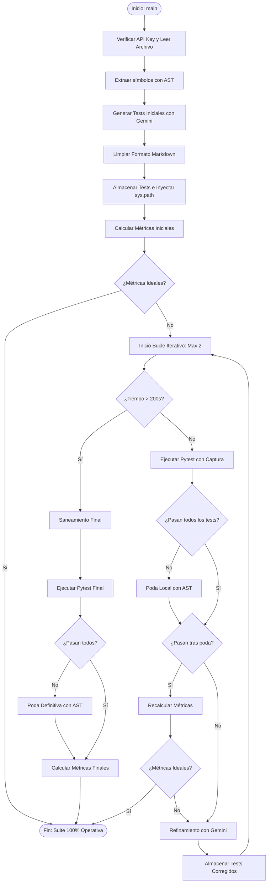

# Tarea 1
Matías Andrés Fuentes Mora (mafm@uc.cl), 
Italo Humberto Lubiano Campodonico (italo.lubiano@uc.cl)

## Inicialización del proyecto
Para asegurarse de tener todas las librerías en tu enterno, corre las siguientes lineas en la terminal.

```
cd ruta/del/proyecto
pip install -r requirements.txt
```
Asimismo, si bien se muestran en el enunciado, para evaluar todos los ejemplos provistos en el repositorio, basta con ejecutar las siguientes lineas de comando:

```
chmod +x run_all.sh
./ run_all.sh
```

## Decisiones de estructura y arquitecura del proyecto
Sin buscar ahondar mucho en el código y las funciones implementadas, se realizó el siguiente diagrama `mermaid` para poder visualizar el flujo del código y cómo se procesan los tests generados por la inteligencia artificial.


Figura 1: Gráfico mermaid que ilustra funcionamiento de código en agent.py. Elaboración Propia (2026).

## Limitaciones Principales
Los principales problemas encontrados durante el desarrollo de la tarea fueron:
- Problemas de importación: Principalmente la inclusión de tildes invertidos (``) en los tests generados por la IA; se limpiaron con una función con regex antes de ser almacenados.
- Errores de sintaxis: Errores asociados a contratos mal interpretados.
- Assertion Roulettes: Existe una fuerte presencia de más de un Assertion por test generado. No obstante, los tests en sí mismos son coherentes a la función y clase puesta a prueba.
- Caída por exceso de demanda del modelo: Uno de los cuello de botella más tediosos fue la pausa que surge a raíz de la alta demanda al modelo gemini-3.5-flash-lite. Para ello, se incorporaron las siguientes medidas:

### Principales medidas de Robustez
- Alimentación de prompts con clases del contenido
- Reconexión a API en caso de caída por demanda.
- Limpieza/parsing de entradas no válidas (e.g. tildes invertidas)
- Aplicación de poda para no eliminar todos los tests por iteración

## Descargo de responsabilidad
El análisis presentado en este README resulta breve para mantenerse dentro de las políticas establecidas por el enunciado (máximo una página). Para un análisis complementario y completo de la evolución de código y los obstáculos presentados, se suguiere revisar el video de presentación en el siguiente enlace: https://youtu.be/Mimo3CKnghc

